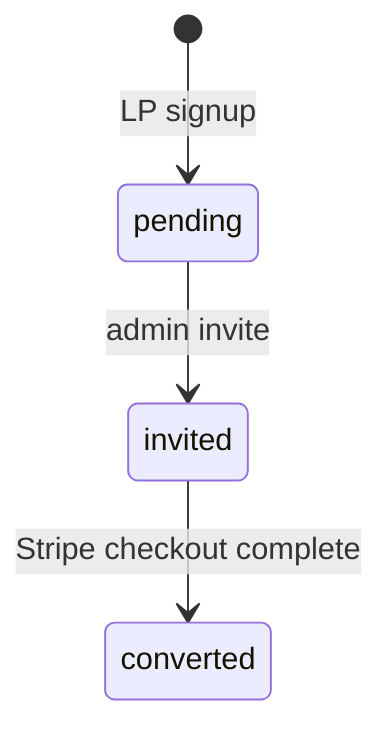

# LP Waitlist Webhook (Phase 4) Implementation Plan

> **Status:** Implemented on branch `feat/onboarding-billing-web`

**Goal:** Ingest waitlist signups from [shogunai.lovable.app](https://shogunai.lovable.app/) into Postgres and let admins invite users into the paid onboarding flow.

---

## Endpoints

| Method | Path | Auth | Purpose |
|---|---|---|---|
| POST | `/api/waitlist` | `x-waitlist-webhook-secret` | LP form signup |
| OPTIONS | `/api/waitlist` | — | CORS preflight for LP origin |
| GET | `/api/admin/waitlist` | `x-admin-api-key` | List + counts |
| POST | `/api/admin/waitlist/invite` | `x-admin-api-key` | Create invite(s) from waitlist |

---

## Waitlist lifecycle



---

## Files

| File | Role |
|---|---|
| `web/src/lib/waitlist.ts` | CRUD + invite helpers |
| `web/src/lib/waitlist-auth.ts` | Webhook secret + CORS |
| `web/src/app/api/waitlist/route.ts` | Public ingest |
| `web/src/app/api/admin/waitlist/route.ts` | Admin list |
| `web/src/app/api/admin/waitlist/invite/route.ts` | Admin invite |
| `web/src/lib/billing.ts` | Marks `converted` on checkout |

---

## Lovable connection (operator steps)

1. Deploy `web/` to `app.shogun.ai` with `WAITLIST_WEBHOOK_SECRET`
2. Configure Lovable form webhook → `POST https://app.shogun.ai/api/waitlist`
3. Send header `x-waitlist-webhook-secret`
4. LP stays **Request Invite** — no visual change required

---

## Admin workflow (gradual rollout B)

1. Review pending: `GET /api/admin/waitlist?status=pending`
2. Invite batch: `POST /api/admin/waitlist/invite` with `{ "limit": 10 }`
3. Send invite URLs via email (manual for now)
4. User completes Web onboarding → Stripe → Desktop

---

## Environment

```bash
WAITLIST_WEBHOOK_SECRET=...
NEXT_PUBLIC_LP_ORIGIN=https://shogunai.lovable.app
ADMIN_API_KEY=...
```
