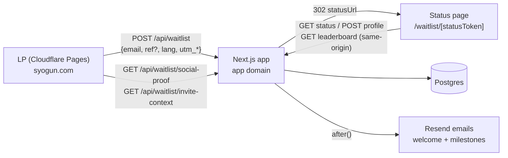

# Waitlist Campaign — Frontend Handoff Spec

**Audience:** the frontend implementer (Codex) building the LP and the
waitlist UI. The backend is DONE, deployed from this repo, and verified —
this document is the contract. Build against it exactly; do not modify
anything under `web/src/app/api/` or `web/src/lib/`.

A working reference implementation of every screen exists at
`web/src/app/waitlist/[code]/WaitlistStatusClient.tsx` — unstyled beyond
tokens, but functionally complete. You may restyle it in place, or
rebuild from scratch against the API below. Either is fine; the API is
the boundary.

---

## 1. System overview



Two credentials per user — **this is the one invariant you must never
blur**:

| | `refCode` (public) | `statusToken` (private) |
|---|---|---|
| Shape | 10 chars base64url | 32 chars base64url |
| Where it appears | share links `syogun.com/?ref=CODE`, X posts | the status page URL only |
| Never | grants status access | appears in share text, OG tags, analytics props, or logs |

The share button must always build its URL from the API's `refCode`
field — never from the page URL (which is the private token).

---

## 2. API contract

Base URL: the app origin (`NEXT_PUBLIC_APP_URL`, e.g.
`https://app.shogun.ai`). All bodies JSON. CORS is enabled for the LP
origins (`syogun.com`, `www.syogun.com`, staging origins via env).

### 2.1 `POST /api/waitlist` — signup (called from the LP)

Request (browser path — send NO secret header):

```json
{
  "email": "user@example.com",
  "lang": "en",                    // "en" | "ja" — controls email language
  "ref": "aB3xK9pQzR",             // optional, from ?ref=
  "utm_source": "x",               // optional, from ?utm_*
  "utm_medium": "social",
  "utm_campaign": "launch",
  "website": "",                    // honeypot — MUST be present in the form,
                                    // hidden from humans, sent only if filled
  "turnstileToken": "..."          // only when Turnstile is enabled (see 6)
}
```

Success `200`:

```json
{
  "ok": true,
  "duplicate": false,              // true = email already registered (still 200)
  "status": "pending",
  "refCode": "aB3xK9pQzR",
  "statusUrl": "https://app.../waitlist/<statusToken>"
}
```

→ **redirect the browser to `statusUrl`** (for duplicates too — returning
users land on their dashboard; this is a feature).

Errors: `400 invalid_email | invalid_json`, `403 forbidden`
(origin not allowlisted) `| bot_check_failed`, `429 rate_limited`
(30/h/IP — show "Too many attempts. Try again in a bit."), `500
server_error`. Error shape is always `{ ok: false, error: "<code>" }`.

### 2.2 `GET /api/waitlist/status?code=<statusToken>` — dashboard data

```json
{
  "ok": true,
  "refCode": "aB3xK9pQzR",
  "createdAt": "2026-07-17T12:00:00.000Z",
  "answers": {
    "timeSink": "context_switching" ,   // null until answered
    "companyRole": "founder, Acme",     // null until answered
    "why": "…",                         // null until answered
    "completed": 2,                     // 0..3
    "formCompletedAt": null             // ISO string once all 3 answered
  },
  "qualifiedReferrals": 7,
  "tier":     { "threshold": 3,  "months": 1, "en": "1 month free",  "ja": "1ヶ月無料" },  // null below 3
  "nextTier": { "threshold": 10, "months": 3, "en": "3 months free", "ja": "3ヶ月無料" },  // null at top
  "leaderboardRank": 4,               // null if no qualified invites
  "position": 312,                    // queue position among pending
  "totalPending": 4820
}
```

`400` malformed token, `404` unknown token → render the "link not
active" state with a link to the LP. Rate limit 300/h/IP.

### 2.3 `POST /api/waitlist/profile` — submit answers

One question per call or all at once; only provided fields update.

```json
{ "code": "<statusToken>", "timeSink": "email_and_slack" }
{ "code": "<statusToken>", "companyRole": "founder, Acme Inc." }
{ "code": "<statusToken>", "why": "one sentence" }
```

- `timeSink` MUST be one of:
  `email_and_slack | meetings_and_notes | context_switching |
  searching_for_things_i_saw | scheduling_and_admin | other`
  (display labels EN/JA are in the copy pack; send the raw value).
- Free-text capped server-side at 1000 chars; cap the inputs client-side
  too.

Response: `{ "ok": true, "formCompleted": false }` — flips to `true` on
the call that completes the third answer. **That flip is the moment their
referrer's counter moves** — celebrate it in UI. Re-fetch status after
every answer: `position` genuinely improves. Errors: 400/404/429 (120/h)
as above.

### 2.4 `GET /api/waitlist/leaderboard` — public top 10

```json
{ "ok": true, "leaderboard": [
  { "rank": 1, "maskedEmail": "ja***@***.com", "qualifiedReferrals": 41 }
]}
```

Cached 60s. Never contains codes, tokens, or raw emails.

### 2.5 `GET /api/waitlist/invite-context?ref=<refCode>` — invited-visitor hero (LP)

Call when the LP loads with `?ref=`. Cached 5 min.

```json
{ "ok": true, "valid": true, "inviter": "ja***@***.com",
  "qualifiedReferrals": 7, "tier": { "...": "..." } }
```

`valid: false` (still 200) → render the generic hero, no error. Use it
for: "**ja\*\*\* saved you a place in line**" personalization. Never show
more than the masked inviter.

### 2.6 `GET /api/waitlist/social-proof` — LP counters

```json
{ "ok": true, "total": 4820, "countries": 37 }
```

Cached 2 min. Rounding/animation is yours (suggest: animate count-up,
floor to nearest 10 below 1000 so it never looks tiny).

### 2.7 `GET /api/waitlist/unsubscribe?token=…`

Email-footer link, returns a minimal HTML page. If you want it branded,
tell the backend owner — do NOT restyle by intercepting the route.

---

## 3. LP requirements (build checklist)

1. **Form**: email input + submit. Client-validate format, but the API is
   the authority. Include the hidden honeypot input exactly:
   `name="website"`, visually hidden (offscreen), `tabindex="-1"`,
   `autocomplete="off"`, `aria-hidden="true"`. Include its value in the
   body only when non-empty.
2. **Param persistence**: on load, read `ref`, `utm_source`,
   `utm_medium`, `utm_campaign` from the query string and persist to
   `sessionStorage` (keys `shogun_ref`, `shogun_utm_source`, …) so a
   visitor who navigates before signing up still attributes. Send them
   with the signup. Send `lang: "en"` from `/`, `lang: "ja"` from `/ja/`.
3. **On success**: redirect to `statusUrl`. On `duplicate: true` there is
   still a `statusUrl` — same redirect.
4. **Invited state**: with a valid `?ref`, swap the hero to the invited
   variant (copy pack §1) using invite-context. This is the highest-EX
   moment on the LP — an invited visitor should feel expected.
5. **Social proof**: total/countries from social-proof, rendered near the
   form.
6. **Reference JS**: current working implementation in `lp/index.html`
   (bottom `<script type="module">`) — param persistence, honeypot,
   redirect, and PostHog capture are all there to copy from.

## 4. Status page requirements

States, in order of appearance:

1. **Loading** → skeleton, not spinner-on-black.
2. **Not found** (400/404) → "link not active" + LP link.
3. **Form flow** (while `answers.completed < 3`): one question per
   screen, `1/3 → 3/3` progress, answer → POST → re-fetch → show the
   position improvement ("Locked in. You moved up." + animate the
   position number change). GDPR line + privacy link
   (`https://github.com/Torutesu/ShogunAI3/blob/main/PRIVACY.md`) must
   stay on the form screens.
4. **Dashboard** (always visible below/after the form):
   - Position: `#312 of 4,820` — the hero number of the page.
   - Referral block: share link (`https://syogun.com/?ref=<refCode>`),
     copy button, X share
     (`https://twitter.com/intent/tweet?text=<urlencoded template>`,
     templates in copy pack §2), the 4-rung ladder with current progress
     ("7 invites · 3 more to 3 months free"), and the replacement rule
     line — it's a rules requirement, keep it visible.
   - Leaderboard: top 10, gold accent for ranks, `leaderboardRank` if
     present ("You are #4 on the board.").
5. **Language**: EN/JA toggle, initial value from `navigator.language`.
   All strings exist in both languages in the copy pack — no new copy
   without checking the copy rules (no competitor names, no tech stack,
   no "AI-powered/revolutionary/game-changing/your second brain", no
   hedging, no emoji).

Design tokens (fixed): bg `#080808`, surface `#141414`, border
`#2A2A2A`, text `#FFFFFF`, mute `#999999`, dim `#666666`, gold
`#C8A96E` — gold is an accent on ≤5% of the screen, never a background.

### Gamification moments worth animation budget

| Moment | Signal | Suggested treatment |
|---|---|---|
| Answer accepted | profile 200 + position delta | position number counts up past others |
| Form completed | `formCompleted: true` | full-screen beat: "Your spot is secured." |
| Qualified invite while viewing | `qualifiedReferrals` delta on poll/refetch | counter tick + progress toward next rung |
| Tier reached | `tier` change | rung lights up gold; matches the email they'll get |
| Board entry | `leaderboardRank` non-null | row highlight |

The backend already emails at every milestone (welcome, first invite,
one-away nudges, tier confirmations) — the UI and the inbox should feel
like one system: same numbers, same ladder, same phrasing.

## 5. Analytics events (PostHog — keep these exact names)

Already emitted by the reference implementation; keep them wired:

| Event | Where | Props |
|---|---|---|
| `waitlist_signup` | LP, after 200 | `duplicate, referred, utm_*` |
| `waitlist_form_answered` | status page, per answer | `question` |
| `waitlist_link_copied` | status page | — |
| `waitlist_share_x` | status page | — |

LP loads PostHog only if `window.SHOGUN_POSTHOG_KEY` is set; app uses
`NEXT_PUBLIC_POSTHOG_KEY`. Never put tokens/emails in event props.

## 6. Environment / config the frontend touches

| Var | Where | Purpose |
|---|---|---|
| `window.SHOGUN_WAITLIST_ENDPOINT` | LP | full URL of `POST /api/waitlist` |
| `window.SHOGUN_POSTHOG_KEY` | LP | optional analytics |
| `NEXT_PUBLIC_TURNSTILE_SITE_KEY` | LP/app | ONLY if bot pressure forces Turnstile on: render the widget in the form and send `turnstileToken`. Until then, omit entirely. |

Everything else (`RESEND_API_KEY`, rate limits, secrets) is
backend-owned; the LP never holds secrets — the webhook secret
especially must never appear in frontend code.

## 7. Acceptance checklist (run before calling it done)

```bash
# happy path: signup → redirected token page loads
curl -s -X POST $APP/api/waitlist -H 'Content-Type: application/json' \
  -H 'Origin: https://syogun.com' -d '{"email":"you+t1@x.com","lang":"en"}'

# invited flow: LP with ?ref renders invited hero (valid) and generic (garbage ref)
# form flow: 3 answers, each improves position; 3rd flips formCompleted
# share: copied link contains refCode (10 chars), NOT the 32-char token
# duplicate signup: redirects to the same dashboard
# 429 handling: rate-limited signup shows a human message, not raw JSON
# ja: /ja/ signup → status page defaults JA → emails arrive in JA
```

Plus: no horizontal scroll on mobile, form usable with keyboard only,
status page never renders the raw statusToken as copyable "share" text.

## 8. Who owns what

| Concern | Owner |
|---|---|
| LP + status page UI/UX, animation, OG images | Codex (frontend) |
| API, DB, emails, rate limits, fraud, legal docs | backend (this repo — ask, don't patch) |
| Copy | copy pack `copy-en-ja.md`; additions must pass the copy rules |
| Campaign rules content | `official-rules.md` — link it from the LP footer as "Referral program rules" |

Questions or missing fields in an API response → request a backend
change; do not work around by scraping pages or storing extra state
client-side.
